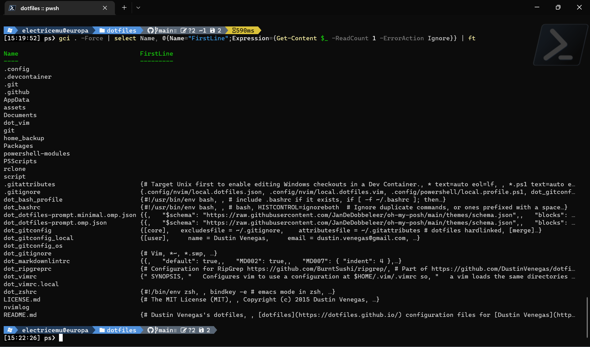
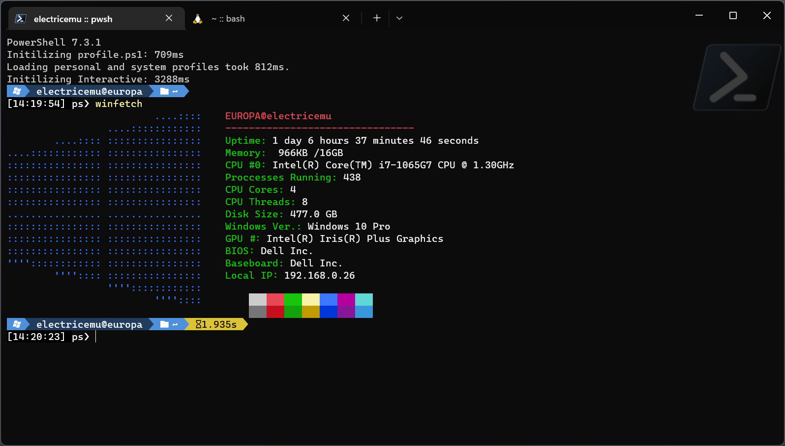
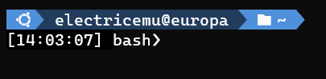
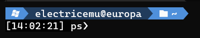
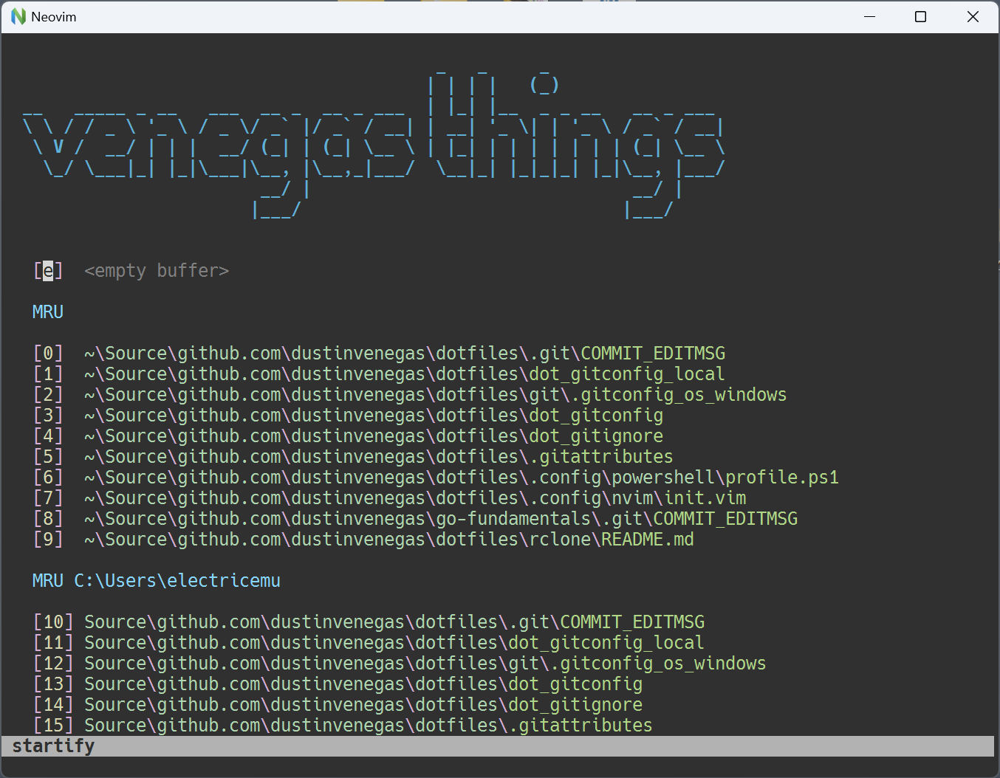

# Dustin Venegas's dotfiles

[dotfiles](https://dotfiles.github.io/) configurations for a portable computing environment based on POSIX and PowerShell by [Dustin Venegas](https://dustinvenegas.com).

[](https://github.com/codespaces/new?hide_repo_select=true&ref=main&repo=35863681&machine=basicLinux32gb&&devcontainer_path=.devcontainer%2Fdevcontainer.json&location=WestUs2)

Targets Linux, macOS, and Windows with native bootstrap scripts. Environments are configured through the magic of symlinks.


## Installation

Bootstrap scripts are located under `./scripts/`. Using native POSIX/PowerShell scripts avoids taking bootstrapping dependencies.

Run a bootstrap script in 'whatif' mode:

- POSIX-Based OS: `./script/bootstrap.sh --whatif --verbose`
- Windows OS:  `./script/bootstrap.ps1 -verbose -whatif`

## Health

Perform a basic environment health check with [`./script/check-dotfles-health.sh`](./script/check-dotfiles-health.sh).

## Why PowerShell Core?

Because piping objects with properties and functions is fun and useful. PowerShell
is just a cross-platform shell. POSIX is for glue code and PWSH is for exploration.

```ps1
Get-ChildItem $HOME -Force | # items in $HOME
  Select-Object Name, @{
    Name="FirstLine";
    Expression={Get-Content $_ -ReadCount 1 -ErrorAction Ignore}
  } | # object with Name and FirstLine.
  Tee-Object -Variable files | # save pipeline to a variable
  Format-Table # output as a table
```



## Package Managers

`./Packages` contains bundles of packages for package managers like Chocolatey, Homebrew, and apt.

```sh
# Chocolatey
choco install ./Packages/chocolatey-desktop.config

# Homebrew
brew bundle install --file=./Packages/Brewfile

# apt
sed 's/#.*//' ubuntu-installs.txt | xargs sudo apt-get install`
```

## Components

Notable components included in this dotfiles repository.

- [bash](https://www.gnu.org/software/bash/) shell.  Local Configuration: `$HOME/.bashrc.local` [docs](https://www.gnu.org/software/bash/manual/bash.html)
- [Markdownlint](https://github.com/markdownlint/markdownlint) is a CLI tool used to lint Markdown files. [docs](https://github.com/markdownlint/markdownlint/blob/master/docs/configuration.md)
- [Kitty](https://github.com/kovidgoyal/kitty) is a terminal emulator for Unix-like platforms. Configuration at `$HOME/.config/kitty/`. [docs](https://sw.kovidgoyal.net/kitty/quickstart/#)
- [ripGrep](https://github.com/BurntSushi/ripgrep/) searches files like grep and also respects your .gitignore. Configuration must be set with envvar `RIPGREP_CONFIG_PATH`. [docs](https://github.com/BurntSushi/ripgrep/blob/master/GUIDE.md)
- [git](https://git-scm.com/) SCM. Local Configuration: `$HOME/.gitconfig_local`. OS Configuration: `$HOME/.gitconfig_os`. [docs](https://git-scm.com/doc)
- [neovim](https://neovim.io/) is a modal editor and successor to vim that works cross platform on Linux, macOS, Windows, and others. [docs](https://neovim.io/doc/)
- [PowerShell Core](https://github.com/PowerShell/PowerShell) cross-platform object-oriented shell. [docs](https://learn.microsoft.com/en-us/powershell/)
- Windows PowerShell is a  Windows-only object-oriented shell.
- [zsh](https://zsh.sourceforge.io/) shell. [docs](https://zsh.sourceforge.io/Doc/)
- [oh-my-posh](https://ohmyposh.dev/) is a custom prompt that works across many platforms. [docs](https://ohmyposh.dev/docs/)
- [rclone](https://rclone.org/) provides programs to manage cloud storage, including mounting, syncing, cp/mv/ls/etc. [docs](https://rclone.org/docs/)
- [Windows Terminal](https://github.com/microsoft/terminal) is a terminal emulator and multiplexer for Microsoft Windows that supports unicode fonts. [docs](https://learn.microsoft.com/en-us/windows/terminal/customize-settings/startup)
- [wsl](https://learn.microsoft.com/en-us/windows/wsl/) Windows Subsystem for Linux. [docs](https://learn.microsoft.com/en-us/windows/wsl/)
- [vim](https://www.vim.org/) the OG modal editor. [docs](https://www.vim.org/docs.php)

## Examples

### Windows Terminal Running PowerShell



### bash on Ubuntu



### pwsh on Windows



### nvim-qt



## Related Projects

* [dotfiles](https://dotfiles.github.io/), your unofficial guide to dotfiles on GitHub.
* [smkent/dotfiles](https://github.com/smkent/dotfiles), dotfiles repository of
  Stephen Kent.
